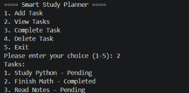

# 📚 Smart Study Planner

A simple command-line study planner built with Python to help students organize and manage their study tasks. This application provides an easy-to-use interface for task management with automatic saving and good error handling.

## 🌟 Overview

The Smart Study Planner helps students stay organized by providing an easy-to-use command-line interface for managing study tasks. Whether you need to track assignments, project deadlines, or daily study goals, this tool helps you keep everything in one place with automatic saving and loading.

## ✨ Features

### What You Can Do
- ➕ **Add new tasks** - Create study tasks with custom descriptions
- 📋 **View all tasks** - Display all tasks with their current status
- ✅ **Mark tasks as completed** - Track your progress by marking tasks as done
- 🗑️ **Delete tasks** - Remove tasks you no longer need with confirmation

### Data Management
- 💾 **Automatic saving** - Tasks are automatically saved to JSON format
- 🔄 **Automatic loading** - Previously saved tasks load when the program starts
- 🛡️ **Data checking** - Makes sure data is correct before saving and loading
- 🔧 **Error fixing** - Handles broken data files smoothly

### User Experience
- ✔️ **Input checking** - Handles wrong inputs without problems
- 🚫 **Crash-proof design** - Never crashes due to user input errors
- ⌨️ **Keyboard handling** - Clean exit when you press Ctrl+C
- 📝 **Clear error messages** - Helpful feedback when issues occur
- 🔄 **Safe operations** - Failed actions don't break your data

## 📷 Demo



## 🛠️ Technologies Used

- **Python 3** - The programming language used
- **JSON** - For saving and loading task data
- **File Operations** - Reading and writing task files
- **Error Handling** - try-except blocks to handle errors
- **Git & GitHub** - For version control

## 📂 Project Structure

```
Smart-Study-Planner/
│
├── main.py           # Main program file with menu system
├── tasks.py          # Task functions (add, view, complete, delete)
├── storage.py        # File operations for saving and loading
├── tasks.json        # Task data file (created automatically)
├── README.md         # This file
├── .gitignore        # Git ignore rules
└── images/           # Demo screenshots
    └── demo.png
```

## 🚀 Installation

### What You Need
- Python 3.6 or higher installed on your computer
- Basic knowledge of using command prompt/terminal

### Installation Steps

1. **Download the project**
   ```bash
   git clone <repository-url>
   cd smart-study-planner
   ```

2. **Check if Python is installed**
   ```bash
   python --version
   # or
   python3 --version
   ```

3. **No extra installations needed**
   - This project uses only Python's built-in features
   - You don't need to install anything with pip

## 🎯 How to Run

### Starting the Program

Go to the project folder and run:

```bash
python main.py
```

**Note:** On some computers, you might need to use:
```bash
python3 main.py
```

### Using the Program

When you start it, you'll see the main menu:

```
==== Smart Study Planner ====
1. Add Task
2. View Tasks
3. Complete Task
4. Delete Task
5. Exit
```

#### Menu Options:

**1. Add Task**
- Type a task description when asked
- Task gets saved automatically with "Pending" status
- Empty descriptions will show an error message

**2. View Tasks**
- Shows all tasks with their status (Pending/Completed)
- Each task has a number for easy reference
- Handles empty task lists without problems

**3. Complete Task**
- Enter the task number to mark as completed
- Status changes from "Pending" to "Completed"
- Changes are saved automatically

**4. Delete Task**
- Enter the task number to delete
- Confirm by typing 'y' or 'n'
- Task is removed only after you confirm
- Changes are saved automatically

**5. Exit**
- Closes the program safely
- All changes are already saved

### Error Handling

The program handles various error situations:

- **Wrong menu choices** - Shows error and shows menu again
- **Empty inputs** - Asks for valid input
- **Wrong task numbers** - Shows error and returns to menu
- **File errors** - Shows error but keeps running
- **Broken data files** - Starts with empty list automatically
- **Ctrl+C** - Clean exit when you press Ctrl+C

## 📖 Code Structure

### How the Code is Organized
The project is split into different files for better organization:

- **main.py**: Handles the user interface, menu, and program flow
- **tasks.py**: Contains all the task functions (add, view, complete, delete)
- **storage.py**: Manages saving and loading data from files

### Programming Concepts Used
- **Functions & Modules**: Code is organized into reusable functions in separate files
- **Error Handling**: try-except blocks to handle errors gracefully
- **Data Validation**: Checking inputs and data before using them
- **File Operations**: Reading and writing JSON files
- **Lists & Dictionaries**: Main data structures for storing tasks
- **User Input**: Getting input from users safely with error recovery
- **Loops**: For menu navigation and going through tasks
- **Exception Handling**: Dealing with different types of errors

### How Errors Are Handled
The program handles errors at different levels:

1. **Input Level**: Catches errors when getting user input
2. **Validation Level**: Checks data types and values before processing
3. **Operation Level**: Handles specific errors for each action
4. **System Level**: General error handling as backup
5. **Data Level**: Checks and fixes broken data files

## 🔧 Troubleshooting

### Common Problems

**Problem**: "python is not recognized as an internal or external command"
- **Solution**: Install Python from python.org or make sure it's in your system PATH

**Problem**: Permission denied when saving tasks
- **Solution**: Make sure you have permission to write in the project folder

**Problem**: Tasks not saving between sessions
- **Solution**: Check that tasks.json file exists in the project folder and can be written to

**Problem**: Broken task data when starting
- **Solution**: The program automatically handles broken files by starting with an empty list

## 🌱 Future Improvements

Ideas for future versions:

- **Due Dates**: Add task due dates with reminders
- **Task Priorities**: Add priority levels (High, Medium, Low)
- **Categories**: Organize tasks by subject or category
- **Search & Filter**: Search tasks by name or status
- **Statistics**: Show completion rates and progress
- **Data Export**: Export tasks to CSV or other formats
- **Multiple Devices**: Sync tasks across different computers
- **Graphical Interface**: Build a GUI version using Tkinter
- **Recurring Tasks**: Support for daily/weekly tasks
- **Task Notes**: Add detailed notes to tasks

## 📝 License

This project is open source and available for learning purposes.

## 🤝 Contributing

Contributions are welcome! Feel free to:
- Report bugs
- Suggest new features
- Improve the code
- Help with documentation

## 📧 Support

For questions or suggestions, please open an issue in the repository.

---

**Made with ❤️ for students who want to stay organized**
